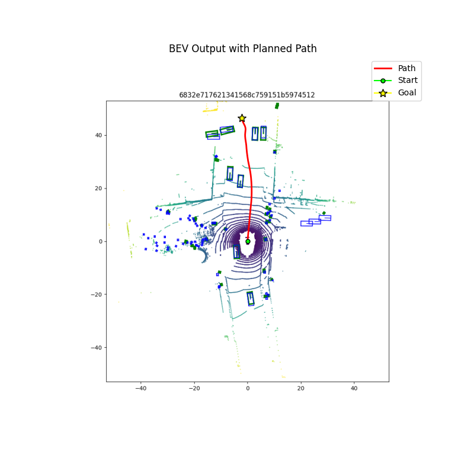
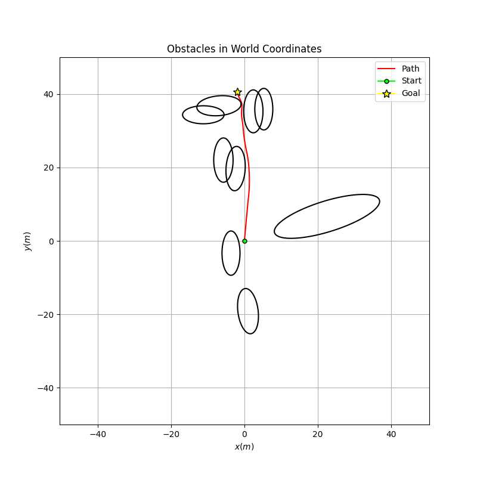
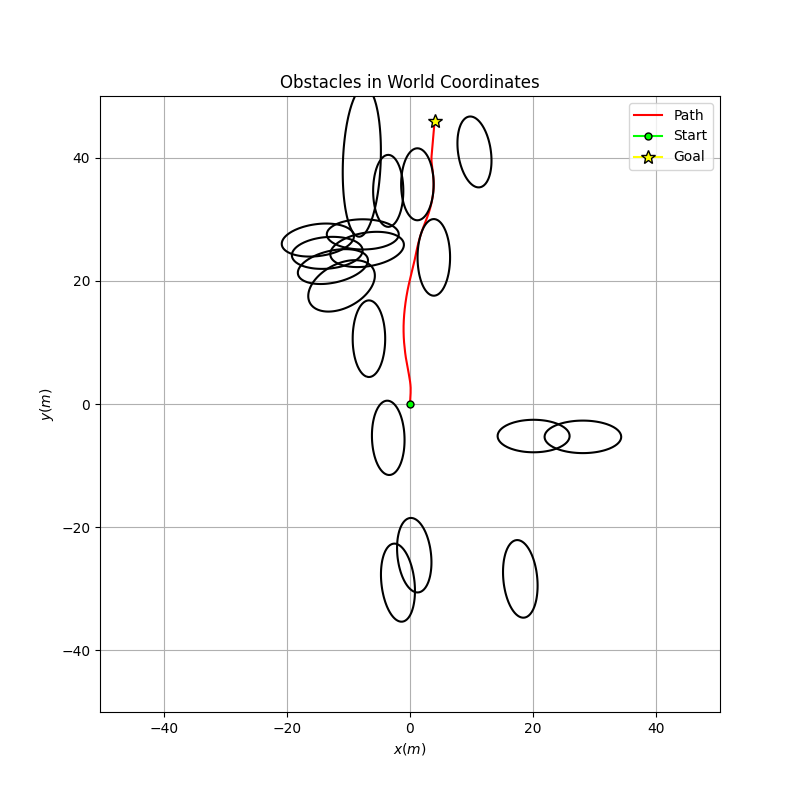
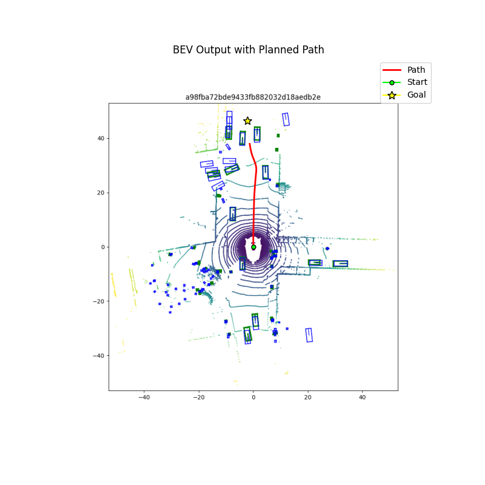
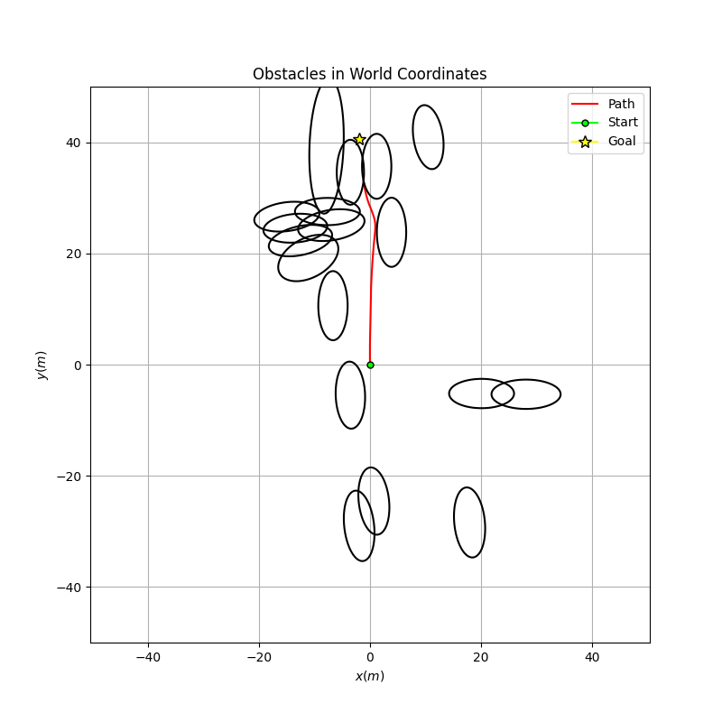
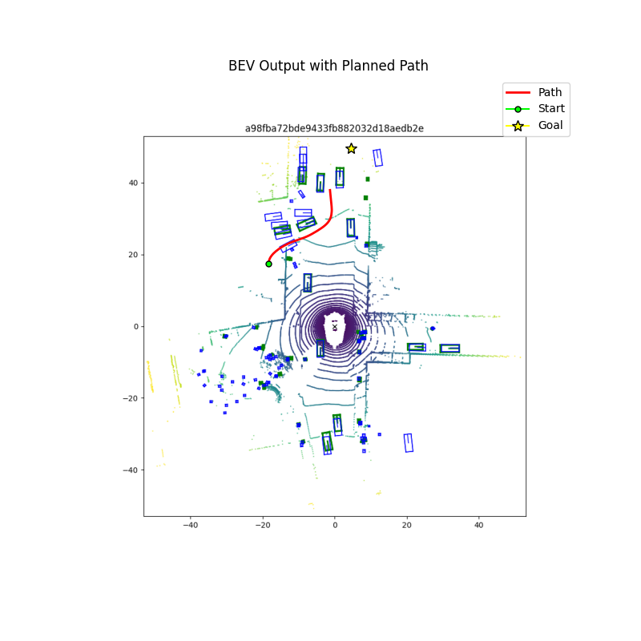
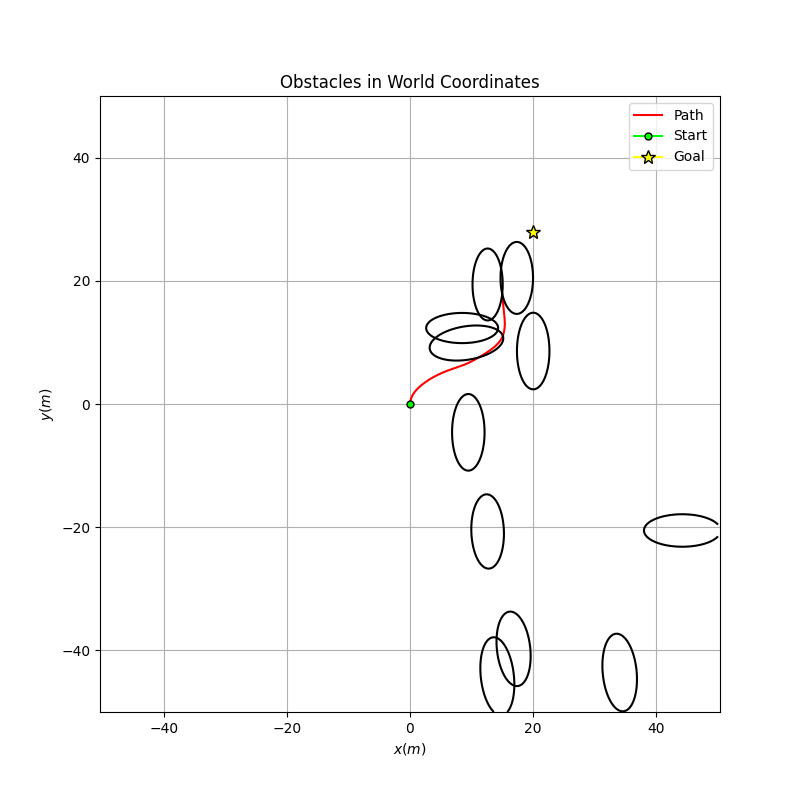

# Obstacle Aware Planning on BEVFormer Generated Environments with MPC-CBF
This work builds on BEVFormer &mdash; a state of the art framework for generating a 2D bird's-eye-view representation of the environment around a vehicle. We use these outputs as the inputs to our planner, which is a model predictive controller augmented with control barrier functions (hence MPC-CBF) for obstacle avoidance. We completed this work as a final project for the University of Michigan's self-driving cars course (ROB 535: Self Driving Cars Perception and Control).

## Contributors
- Chitra Devulapalli ([LinkedIn](https://www.linkedin.com/in/chitrangada-devulapalli-897a8a194/), [GitHub](https://github.com/Chitra-devulapalli))
- Peter Redman ([LinkedIn](www.linkedin.com/in/peter-redman1), [GitHub](https://github.com/paredman))
- Pannaga Sudarshan ([LinkedIn](https://www.linkedin.com/in/pannaga-sudarshan-98815a15a/), [GitHub](https://github.com/PannagaS))

## Contents
Our current program resides in three files:
- `main.py`: Main file for our program. Reads in output from BEVFormer and runs our planning pipeline.
- `mpc.py`: Contains all of our code for trajectory optimization with CasADi.
- `helpers.py`: Containts various helper functions for image processing, coordinate transformations, and plotting results.

And we provide many additional materials:
- `archive/`: Experimental files we used in prototyping
- `data/`: Contains outputs from BEVFormer, 2D bird's-eye-view representations of the environment
- `media/`: Our poster and final report on this project
- `results/`: Multiple examples of the outputs our MPC-CBF formulation produces

## Overview of Project
At a high level, our contribution was as follows:
- Utilize classical computer vision techniques to extract ego vehicle and obstacle positions from BEVFormer output
- Mathematically transform the detected obstacles into the static world frame
- Compute bounding ellipses for each obstacle
- Assigned a control barrier function (CBF) to each obstacles
- Developed a model predictive control (MPC) formulation to plan a path from the ego vehicle's current location to an arbitrary goal location, integrating the CBF's from the previous step for obstacle avoidance. We used CasADi for the trajectory optimization.

The poster (pictured below, also available in the `media/` directory) we created to present our work provides a good explanation of our project and results. If you are interested in a more detailed explanation, please see our [final report](./media/Team%202%20Final%20Report.pdf) in the `media/` directory.

## Results
In the majority of tested scenarios, our MPC-CBF planner produces a safe, efficient, and physically realistic path for the ego vehicle to navigate from its current location to a desired location. One can see this by perusing the many images we have produced and stored in our `results/` directory. The images below can be found in `results/image2_12/` and `results/image3_4`, respectively.

Of course, in some cases, the planner fails to find a safe path (see `results/image3_5`).

## Shortcomings
It appears to us that the iron-clad guaranty of safety that a single control barrier function provides does not extend to environment where multiple (possibly conflicting) control barrier functions are at play. In the `results/` directory, you can find multiple images like the one below, where the planned path actually clips through an obstacle briefly. Clearly, this is an unacceptable breach of safety. We hope to examine this issue more carefully in the future, and determine if we can formulate a solution.

